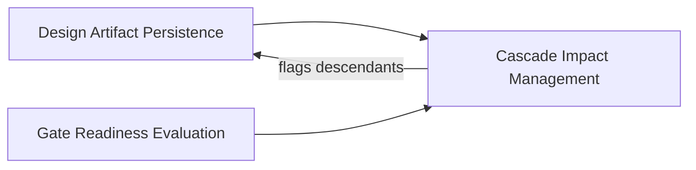

# Cascade Impact Management

**Altitude:** 30K — Capabilities
**Status:** open
**Minor Gate ID:** capabilities/cascade-impact-management
**Parent:** 30K major gate

---

## Intent

Surface downstream effects when a design decision changes so that all derived work can be reviewed before continuing. This capability ensures the artifact tree stays internally consistent — when a node at a higher altitude changes, every descendant that was derived from it is flagged for review rather than silently left in a stale state.

---

## Diagram

---

## Decisions

---

## Principles Referenced

---

## Deferred Details

---

## Children

| Minor Gate | Status |
|------------|--------|
