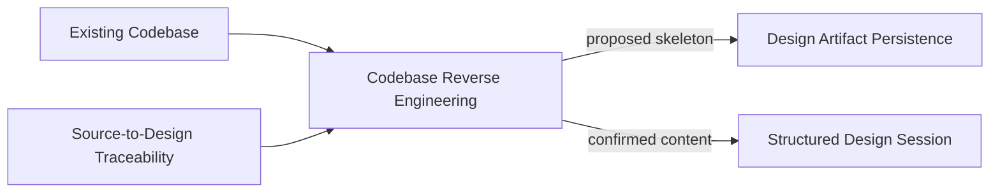

# Codebase Reverse Engineering

**Altitude:** 30K — Capabilities
**Status:** open
**Minor Gate ID:** capabilities/codebase-reverse-engineering
**Parent:** 30K major gate

---

## Intent

Bootstrap an AGD session from signals in an existing codebase rather than starting from scratch. This capability serves practitioners who have existing code but no artifact tree — it reads discoverable signals (READMEs, manifests, directory structure, annotations) and proposes a starting skeleton that the practitioner then confirms, adjusts, or rejects altitude by altitude.

---

## Diagram

---

## Decisions

---

## Principles Referenced

---

## Deferred Details

---

## Children

| Minor Gate | Status |
|------------|--------|
