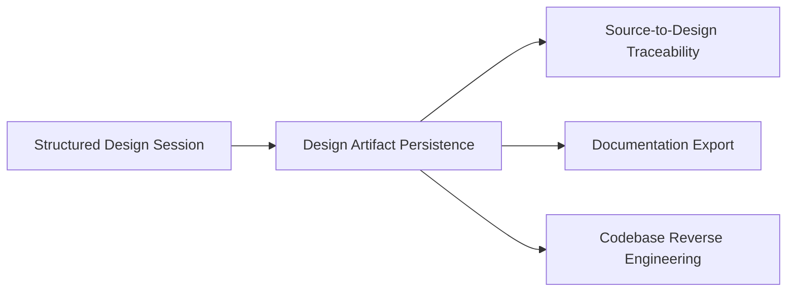

# Design Artifact Persistence

**Altitude:** 30K — Capabilities
**Status:** open
**Minor Gate ID:** capabilities/design-artifact-persistence
**Parent:** 30K major gate

---

## Intent

Maintain a durable fractal tree of design decisions, intent, and principles at each altitude. This capability ensures that everything captured during a design session survives the session — decisions, rationale, diagrams, and deferred details are written to a persistent artifact tree that any practitioner or AI agent can consume later.

---

## Diagram

---

## Decisions

---

## Principles Referenced

---

## Deferred Details

---

## Children

| Minor Gate | Status |
|------------|--------|
