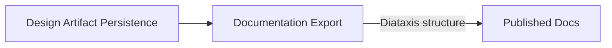

# Documentation Export

**Altitude:** 30K — Capabilities
**Status:** open
**Minor Gate ID:** capabilities/documentation-export
**Parent:** 30K major gate

---

## Intent

Convert the artifact tree into Diataxis-structured docs any stakeholder can read, independent of the AGD protocol. This capability produces human-readable documentation from the artifact tree — explanation, reference, how-to guides, and tutorials — so that the design work done in AGD sessions is accessible to stakeholders who will never interact with AGD directly.

---

## Diagram

---

## Decisions

---

## Principles Referenced

---

## Deferred Details

---

## Children

| Minor Gate | Status |
|------------|--------|
