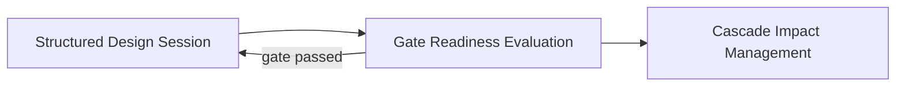

# Gate Readiness Evaluation

**Altitude:** 30K — Capabilities
**Status:** open
**Minor Gate ID:** capabilities/gate-readiness-evaluation
**Parent:** 30K major gate

---

## Intent

Determine when an altitude's work is complete and ready to advance, with optional adversarial stress-testing of decisions before locking in. This capability prevents premature descent — ensuring that each altitude's major gate items and minor gates are substantively resolved before the practitioner moves to a lower altitude.

---

## Diagram

---

## Decisions

---

## Principles Referenced

---

## Deferred Details

---

## Children

| Minor Gate | Status |
|------------|--------|
