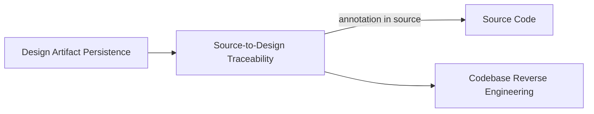

# Source-to-Design Traceability

**Altitude:** 30K — Capabilities
**Status:** open
**Minor Gate ID:** capabilities/source-to-design-traceability
**Parent:** 30K major gate

---

## Intent

Link source code files to their governing artifact nodes so design intent travels with the code. This capability ensures that the connection between implementation and the decisions that shaped it is not lost — a developer reading a file can navigate to the artifact node that explains why the code is structured the way it is.

---

## Diagram

---

## Decisions

---

## Principles Referenced

---

## Deferred Details

---

## Children

| Minor Gate | Status |
|------------|--------|
