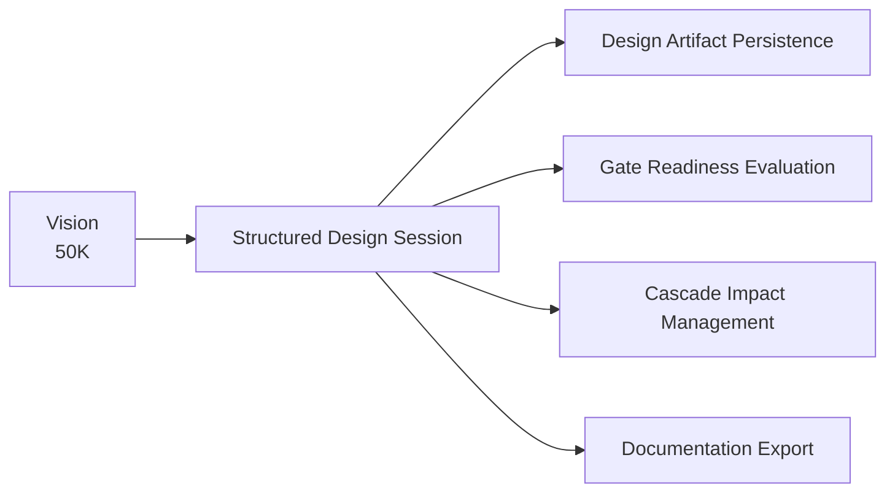

# Structured Design Session

**Altitude:** 30K — Capabilities
**Status:** open
**Minor Gate ID:** capabilities/structured-design-session
**Parent:** 30K major gate

---

## Intent

Guide a practitioner through altitude-gated design conversations (vision → capabilities → architecture → design → implementation), with altitude discipline and a working loop. This is the primary interaction capability of AGD — the structured conversation that ensures design intent is captured at the right level of abstraction before descending.

---

## Diagram

---

## Decisions

---

## Principles Referenced

---

## Deferred Details

---

## Children

| Minor Gate | Status |
|------------|--------|
