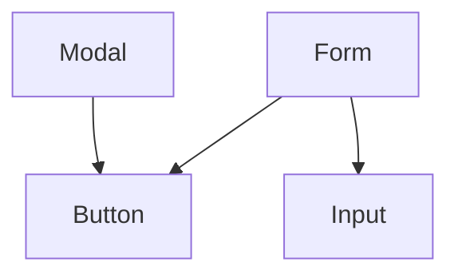

# enrich-rules

Adds mermaid component relationship diagrams to your `.claude/rules/` files. Uses `madge` for accurate import analysis — no grep-based inference.

## Step 1 — Check Prerequisites

**Check madge:**

Run `npx madge --version`. If it fails, stop and tell the user:

> This skill requires madge. Install it with: `npm install -g madge`

**Check exploration artifact:**

Check if `.claude/hier-artifacts/exploration.yaml` exists. If not, stop and tell the user:

> No exploration artifact found. Run `init-advanced` to scaffold your rules files first.

**Check rules files:**

Glob `.claude/rules/**/*.md`. If no files found, stop and tell the user:

> No rules files found. Run `init-advanced` to scaffold your rules files first.

## Step 2 — Read Source Root

Read `.claude/hier-artifacts/exploration.yaml` and extract `project.root` (e.g., `src/`).

## Step 3 — Build Dependency Graph (in context)

Run:

```bash
npx madge --json <root>
```

Where `<root>` is the value from `project.root`.

madge returns a flat JSON object — each key is a file path relative to the source root, mapping to its local imports:

```json
{
  "components/Button.tsx": ["lib/utils.ts", "hooks/useTheme.ts"],
  "hooks/useTheme.ts": ["lib/theme-utils.ts"]
}
```

Prepend the source root to every path to make them project-relative (e.g., `src/components/Button.tsx`). Then build a reverse index (`imported_by`) by scanning all entries. Hold the entire graph in context — do not write it to disk.

## Step 4 — Generate Diagrams

Glob `.claude/rules/**/*.md`. For each file:

1. Read the `paths:` frontmatter to identify the source directory it covers.
2. Check for a component inventory: look for `###` entries with `**File:**` lines (the standard module-template format).
3. Extract each component's source file path from its `**File:**` line.
4. From the dependency graph, find every edge where both the importing file and the imported file belong to this rules file's source directory. These are intra-directory edges.

**Skip** if fewer than 5 components OR no intra-directory edges. Note the skip in your report.

**If 20+ components:** limit to the top 10 by `imported_by` count from the reverse index.

**Generate a mermaid `graph TD` diagram:**

- Each intra-directory import becomes an edge: `Importer --> Imported`
- Use short names (strip path and extension)
- For components that import something outside this directory, add the external node with styling:
  ```
  ExternalHook:::external
  classDef external fill:#f5f5f5,stroke:#999,stroke-dasharray:4
  ```
- Only show cross-directory imports if the importing component is already in the diagram

**Quality gate — before every Edit:**

- Every edge in the diagram must correspond to an entry in the dependency graph. No exceptions.
- Do not add the section if `## Component Relationships` already exists in the file.

**Insert** the diagram as a `## Component Relationships` section after the last `###` component entry and before any `## Subdirectories` section (or at the end of the file if neither exists):

````markdown
## Component Relationships


````

## Step 5 — Report

```
📊 Diagrams added:
  .claude/rules/components/components.md (8 nodes)
  .claude/rules/ui/ui.md (5 nodes)

⏭️ Skipped:
  .claude/rules/pages/pages.md — fewer than 5 components
  .claude/rules/lib/lib.md — no intra-directory import edges
```
